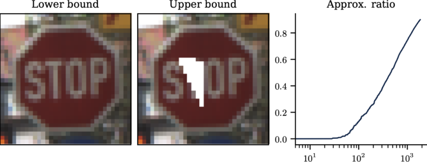

[](https://github.com/Aggrathon/Premap2/actions/workflows/pytest.yaml)
[](https://github.com/Aggrathon/Premap2/actions/workflows/pytest.yaml)
[](https://github.com/Aggrathon/Premap2/actions/workflows/pytest.yaml)
[](https://github.com/Aggrathon/Premap2/blob/main/LICENSE)
[](https://github.com/Aggrathon/Premap2/releases)
[](https://doi.org/10.48550/arXiv.2505.22798)
[](https://github.com/Aggrathon/Premap2/blob/main/CITATIONS.bib)
# PREMAP: Preimage Approximation for Neural Networks

PREMAP is an algorithm for finding both over- and under-approximations for preimages of neural networks.
The preimage is the set of inputs that lead to a specified set of outputs.
Hence, preimage under-approximation can be used for, e.g., quantitative certification of neural networks.
See below for an example or the paper for more information:

> Björklund, A., Zaitsev, M. and Kwiatkowska, M. (2025).
> **Efficient Preimage Approximation for Neural Network Certification**.
> Available at: [arXiv:2505.22798](https://doi.org/10.48550/arXiv.2505.22798).

This repository builds upon the [original PREMAP repository](https://github.com/Zhang-Xiyue/PreimageApproxForNNs), which is included as a git subtree in [PreimageApproxForNNs](PreimageApproxForNNs/).
The main goal of this version is to improve the scalability so that, e.g., it is feasible to certify convolutional neural networks against patch attacks (more info in [the paper](https://doi.org/10.48550/arXiv.2505.22798))


## Example



See [the paper](https://doi.org/10.48550/arXiv.2505.22798) for more examples and use cases.


## Usage

This project was set up using [uv](https://docs.astral.sh/uv) (just run `uv sync` to install all dependencies), but if you prefer "normal" python package management you can use `pip install --editable .` (see `pyproject.toml` for a list of dependencies).

### CLI

The PREMAP CLI is available through `uv run premap` and works just like [before](https://github.com/Zhang-Xiyue/PreimageApproxForNNs) (which is similar to [α,β-CROWN](https://github.com/Verified-Intelligence/alpha-beta-CROWN)).

```bash
git clone https://github.com/Aggrathon/Premap2.git && cd Premap2
# NOTE: The --directory is only used to get the correct local paths in the config
uv run --directory PreimageApproxForNNs premap --config src/preimg_configs/vcas.yaml --enable_input_split False
# For more details see
uv run premap --help
```

To avoid manually cloning the reposity you can also use:

```bash
uvx --with https://github.com/Aggrathon/Premap2 premap2
```


### Package

In addition, it is (now) possible to run PREMAP as a library by either cloning the repo or adding it as a dependency with:

```bash
uv add https://github.com/Aggrathon/Premap2
```

From Python we use the `premap` function (`from premap2 import premap`) that takes the same arguments as the CLI (but without the `--` in front) and returns paths to where the results are stored. With this function you can also pass the model as a `torch.nn.Module` and the data as a list (instead of a `Customized("path","function")`).

```python
from premap2 import premap, get_arguments
import torch

# Fully connected network, certifying against all other classes
model = torch.nn.Sequential(torch.nn.Linear(20, 5), torch.nn.ReLU(), torch.nn.Linear(5, 3))
x = torch.rand((1, 20))
y = model(x).argmax(1)
x_max = 1.0
x_min = 0.0
results = premap(model=model, dataset=(x, y, x_max, x_min), label=0, num_outputs=3, robustness_type='verified-acc')

# Convolutional neural netwok, certifying a patch attack against the runner up class
model = torch.nn.Sequential(torch.nn.Conv2d(3, 8, 3), torch.nn.ReLU(), torch.nn.Flatten(), torch.nn.Linear(8*3*3, 4))
x = torch.rand((1, 3, 5, 5))
y = model(x)
c = y.argmax(1)
y[:, c] = -1000
runner_up = y.argmax(1)
results = premap(model=model, dataset=(x, c, 1.0, 0.0), label=c[0], patch_x=1, patch_y=2, patch_w=3, patch_h=2, runner_up=runner_up, num_outputs=4, robustness_type='runnerup', threshold=0.75)

# To read the results
result = torch.load(results[0])

# To get a list of available arguments use
print(get_arguments())
```


## Development

### Structure

- `PreimageApproxForNNs` is a git subtree of the original PREMAP repository (with changes)
- `src/premap2` contains new files for PREMAP.
- `src/premap` is a symlink to `PreimageApproxForNNs/src`.
- `src/auto_LiRPA` is a symlink to `PreimageApproxForNNs/auto_LiRPA`.
- `test` contains unit tests for premap2.

The coding style for new code is [black](https://github.com/psf/black).
When editing the subtree (`PreimageApproxForNNs`), please disable auto-formatting to keep the git diff readable.
The formatter [ruff](https://docs.astral.sh/ruff) is already configured to skip the subtree.

### Testing

To run the unit tests in [tests](tests/) use `uv run pytest`.
This will also collect test coverage statistics that can be viewed using `uv run coverage html`.

### Profiling

If you want to profile some code run with the Python built-in profiler run
`uv run python -m cProfile -o profile.prof -s time -m premap ...`
to record the execution.
Then you can use, e.g., [snakeviz](https://github.com/jiffyclub/snakeviz) to visualize it with `uvx snakeviz profile.prof`.


## Acknowledgements

This project received funding from the ERC under the European Union’s Horizon 2020 research and innovation programme (FUN2MODEL, grant agreement No. 834115)
and ELSA: European Lighthouse on Secure and Safe AI project (grant agreement No. 101070617 under UK guarantee).
